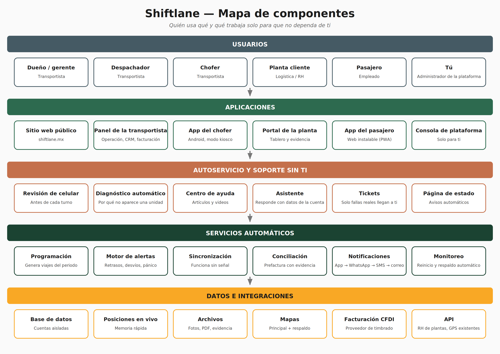
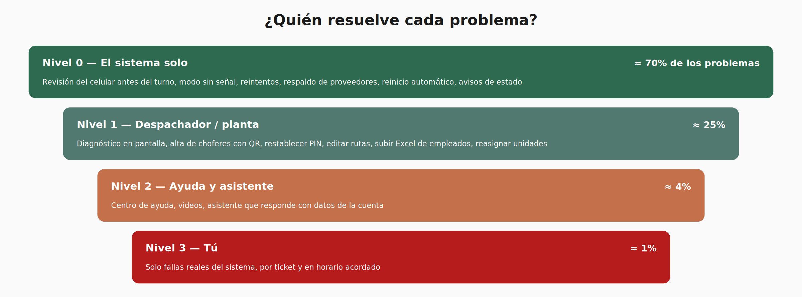

# Shiftlane — Descripción funcional

Descripción funcional completa del sistema

------------------------------------------------------------------------

*Plataforma para transporte de personal: componentes, funciones y operación casi sin soporte*

Felix Armando Acosta · Ciudad Juárez, Chihuahua · Octubre 2026

## 1. Qué es Shiftlane

Shiftlane es una plataforma para **empresas de transporte de personal** que permite planear, operar, comprobar y cobrar cada viaje que realizan para las plantas que las contratan. Une en un solo sistema a la transportista, sus choferes, los empleados que viajan y la planta cliente.

Además de resolver la operación, está diseñada con un objetivo adicional: **funcionar casi sin soporte humano del dueño de la plataforma**. Cada problema típico (celulares, choferes nuevos, cambios de ruta, fallas de proveedores, urgencias de madrugada) se detecta, se explica y se resuelve dentro del propio sistema, o lo resuelve la persona correcta en la transportista o en la planta.

| **Lo que resuelve** | **Cómo** |
|:--:|----|
| **Comprobar que cada viaje se hizo** | Recorrido GPS, abordaje con gafete, horarios y fotos, todo en una evidencia por viaje |
| **Saber en tiempo real si el turno llegará a tiempo** | Mapa en vivo, hora estimada de llegada y alertas automáticas |
| **Cobrar sin discusiones** | Conciliación automática de viajes realizados contra programados y prefactura con evidencia |
| **Mantener la flota y los choferes en regla** | Control de documentos y vencimientos con avisos y bloqueos |
| **Usar mejor las unidades** | Reportes de ocupación real por ruta y horario |
| **Operar sin depender de soporte externo** | Autoservicio, diagnóstico automático, ayuda integrada y soporte por niveles |

## 2. Todo lo que incluye la plataforma

*Figura 1. Mapa de componentes de Shiftlane*

| **Componente** | **Qué es** | **Quién lo usa** | **Dispositivo** |
|:--:|----|----|----|
| **Sitio web público** | Página de presentación, solicitud de demo, centro de ayuda público y página de estado | Prospectos y clientes | Navegador |
| **Panel de la transportista** | El sistema central: operación, catálogos, monitoreo, clientes (CRM), cumplimiento, mantenimiento, facturación y reportes | Dueño, gerentes, programadores, despachadores, administración, mantenimiento | Computadora y tableta |
| **App del chofer** | Aplicación Android de uso diario en la unidad | Choferes | Celular Android |
| **Portal de la planta** | Tablero en vivo, evidencia, solicitudes, aprobación de prefacturas y reportes | Logística, RH y seguridad de la planta | Computadora y celular |
| **App del pasajero** | Aplicación web instalable: ubicación del camión, credencial QR, avisos y quejas | Empleados que viajan | Celular (cualquier marca) |
| **Consola de plataforma** | Administración de todas las cuentas, suscripciones, salud del sistema, tickets y métricas | Tú (dueño de Shiftlane) | Computadora |
| **Servicios automáticos** | Procesos que trabajan solos: programación, alertas, sincronización, conciliación, notificaciones, monitoreo y respaldos | Nadie los opera | Servidor |
| **Centro de ayuda y asistente** | Artículos, videos y un asistente que responde con datos de la cuenta | Todos los usuarios | Dentro de cada aplicación |
| **Administración de dispositivos** | Configuración remota y modo kiosco de los celulares de la empresa | Transportista (configurado una vez) | Celulares de la empresa |
| **API e integraciones** | Conexión con sistemas de RH de plantas, GPS existentes y facturación | Sistemas externos | Servidor |

## 3. Usuarios y permisos

| **Usuario** | **Componente** | **Qué puede hacer** |
|:--:|----|----|
| **Dueño / gerente** | Panel | Todo: configuración, usuarios, clientes, contratos, operación, facturación, reportes |
| **Programador de rutas** | Panel | Rutas, paradas, horarios, programación de viajes |
| **Despachador / monitorista** | Panel | Asignar unidades y choferes, monitoreo en vivo, alertas, incidentes, alta de choferes y restablecer PIN |
| **Administración** | Panel | Conciliación, prefacturas, facturas, cobranza |
| **Mantenimiento** | Panel | Unidades, servicios, combustible, documentos de unidades |
| **Chofer** | App del chofer | Sus viajes, checklist, escaneo de pasajeros, incidentes, botón de pánico |
| **Usuario de planta (logística)** | Portal | Tablero en vivo, evidencia, solicitudes de viajes, aprobación de prefacturas |
| **Usuario de planta (RH)** | Portal | Lista de empleados, asistencia transportada, quejas |
| **Pasajero** | App del pasajero | Su ruta, ubicación del camión, credencial, avisos, calificación |
| **Administrador de plataforma (tú)** | Consola | Cuentas, suscripciones, salud del sistema, tickets de nivel 3 |

Los permisos se asignan por rol y se pueden ajustar por usuario. Cada transportista solo ve su información; cada planta solo ve los viajes que le corresponden, aunque trabaje con varias transportistas.

## 4. Sitio web público

- **Página principal:** qué es Shiftlane, beneficios para transportistas y para plantas, cómo funciona, casos de uso.

- **Solicitud de demostración y de piloto:** formulario que crea automáticamente el prospecto en la consola de plataforma.

- **Registro autoservicio (opcional):** una transportista puede crear su cuenta de prueba y seguir el asistente de configuración sin intervención.

- **Centro de ayuda público:** artículos y videos accesibles sin iniciar sesión (útil para choferes y pasajeros nuevos).

- **Página de estado:** estado en tiempo real de cada parte del servicio (panel, app del chofer, mapas, notificaciones, facturación) e historial de incidentes.

- **Descargas:** enlace a la app del chofer y acceso a la app del pasajero.

- **Avisos legales:** aviso de privacidad, términos de uso y política de ubicación.

## 5. Panel de la transportista

Es el corazón del sistema. Funciona en computadora y tableta y se organiza en módulos.

### 5.1 Inicio (tablero)

- Resumen del turno actual: viajes por iniciar, en curso, terminados, retrasados y con problema.

- Alertas activas ordenadas por urgencia, cada una con su causa y la acción sugerida.

- Indicadores del día y del mes: puntualidad, viajes realizados, ocupación promedio, incidentes.

- Pendientes: documentos por vencer, solicitudes de plantas, prefacturas por revisar, objeciones.

### 5.2 Asistente de configuración inicial (autoservicio)

Guía paso a paso que lleva a una transportista nueva de cero a operar, sin ayuda externa:

1.  Datos de la empresa y logo.

2.  Turnos y reglas de operación (tolerancias, velocidad máxima, etc.).

3.  Carga de unidades y choferes desde plantillas de Excel.

4.  Alta de clientes y plantas.

5.  Trazo de rutas y paradas en el mapa (o importación).

6.  Invitación a la planta para que cargue a sus empleados.

7.  Configuración de celulares (código QR de instalación).

8.  Viaje de prueba guiado.

Una barra de progreso muestra qué falta, y cada paso tiene un video de un minuto.

### 5.3 Catálogos

| **Catálogo** | **Información y funciones** |
|:--:|----|
| **Unidades** | Número económico, placas, modelo, año, capacidad, fotos; permiso, seguro, tarjeta de circulación y verificación con vencimientos; estado (disponible, en ruta, mantenimiento, fuera de servicio); kilometraje |
| **Choferes** | Datos, foto, contacto de emergencia; licencia, examen médico, antidoping y capacitaciones con vencimientos; unidad y turnos habituales; historial y calificación. Alta con QR de acceso y PIN, sin contraseña |
| **Clientes y plantas** | Empresas, plantas, direcciones, puertas de acceso, contactos por área, QR fijo de llegada por puerta |
| **Contratos y tarifas** | Rutas incluidas, tarifa por viaje, ruta, kilómetro, unidad o pasajero; tarifas especiales; penalizaciones acordadas |
| **Pasajeros** | Lista de empleados por planta (cargada por la planta), gafete o credencial, ruta, parada y turno; estado activo o inactivo; provisionales por resolver |
| **Rutas y paradas** | Trazo en el mapa, paradas ordenadas con horario por turno, rutas de entrada y salida, pasajeros por parada, versiones con fecha de vigencia |
| **Plantillas** | Checklists de unidad, tipos de incidente, mensajes predefinidos |

Todos los catálogos permiten importar y exportar en Excel, buscar, filtrar y ver el historial de cambios.

### 5.4 Editor de rutas

- Trazo visual sobre el mapa: agregar, mover, ordenar y eliminar paradas arrastrando.

- Cálculo automático de distancia y tiempo estimado; sugerencia de horario por parada.

- Vista de pasajeros asignados por parada y ocupación esperada.

- **Cambios temporales con fecha:** una modificación aplica solo entre dos fechas y luego la ruta vuelve sola a su versión normal.

- **Simulación:** antes de guardar, muestra qué viajes, pasajeros y choferes se verán afectados.

- Historial de versiones y restaurar una versión anterior.

### 5.5 Programación de servicios

- Generación automática de todos los viajes del periodo a partir de rutas, turnos y calendario (incluye días festivos y fines de semana configurables).

- Asignación de unidad y chofer: automática según la asignación habitual o manual.

- Copiar la programación de la semana anterior.

- **Detección de conflictos antes de que ocurran:** chofer en dos viajes a la vez, unidad en mantenimiento, documentos vencidos, capacidad menor que pasajeros asignados, chofer sin licencia del tipo requerido.

- Viajes extraordinarios (tiempo extra, cambio de turno, eventos) creados manualmente o desde solicitudes de la planta.

- Calendario visual por día, semana, ruta, unidad o chofer, con arrastrar y soltar.

### 5.6 Monitoreo en vivo y despacho

- Mapa con todas las unidades en tiempo real y color por estado: por iniciar, en camino, recogiendo, llegando, terminado, con problema.

- Lista del turno con avance, pasajeros a bordo y hora estimada de llegada a planta.

- Detalle de cada viaje: recorrido real contra planeado, paradas cumplidas con hora, pasajeros por parada, fotos del checklist e incidentes.

- **Diagnóstico de cada unidad** (ver sección 10): estado del celular, último dato recibido y causa probable si dejó de reportar.

- Acciones con un clic: reasignar el viaje a otra unidad y chofer, enviar unidad de respaldo, avisar a la planta, mandar mensaje al chofer, registrar la solución de un incidente.

- Reproducción de cualquier viaje pasado sobre el mapa.

### 5.7 Alertas e incidentes

| **Alerta automática** | **Se activa cuando…** |
|:--:|----|
| **Viaje no iniciado** | Llega la hora de inicio y el chofer no ha iniciado |
| **Retraso** | La hora estimada de llegada supera la tolerancia |
| **Desvío** | La unidad se sale de la ruta más allá de la distancia permitida |
| **Exceso de velocidad** | Supera el límite configurado |
| **Parada no programada** | Detenida más tiempo del permitido fuera de una parada |
| **Sobrecupo** | Pasajeros a bordo superan la capacidad |
| **Pánico** | El chofer presiona el botón de pánico |
| **Falla de checklist** | Algún punto de revisión no aprobado |
| **Unidad sin reportar** | El celular deja de enviar datos durante un viaje (con causa probable) |
| **Documento vencido** | Se asigna una unidad o chofer con documentos vencidos |

Cada alerta muestra causa, ubicación y acción sugerida; registra quién la atendió, qué se hizo y cuánto tardó. Las alertas se pueden escalar automáticamente al gerente si nadie las atiende en cierto tiempo.

### 5.8 Clientes (CRM)

- Ficha de cada cliente y planta con contactos, contratos, rutas, historial de servicio, solicitudes, quejas y facturación.

- Prospectos: registro de empresas interesadas, seguimiento de propuestas y estado (contactado, cotizado, en piloto, ganado, perdido).

- Cotizador de rutas nuevas con base en distancia, horarios y tarifas.

- Bandeja de solicitudes de las plantas (viajes extra, cambios, altas de empleados, quejas) con estado y respuesta.

- Indicadores por cliente: puntualidad entregada, quejas, rentabilidad, saldo por cobrar.

### 5.9 Cumplimiento y vencimientos

- Expediente digital de cada unidad y chofer con todos sus documentos.

- Calendario de vencimientos y avisos a 30, 15 y 5 días al responsable.

- Bloqueo o advertencia al asignar unidades o choferes con documentos vencidos.

- Reporte de cumplimiento listo para auditorías de clientes o autoridades; la planta puede verlo en su portal.

### 5.10 Mantenimiento y combustible

- Servicios preventivos por kilómetros o fecha con avisos; registro de reparaciones, costos y taller.

- Unidades fuera de servicio con fecha estimada de regreso (excluidas automáticamente de la programación).

- Cargas de combustible, rendimiento por unidad y costo por kilómetro.

### 5.11 Conciliación y facturación

- Comparación automática de viajes programados contra realizados por planta y periodo.

- Clasificación de cada viaje: completo, con retraso, incompleto, cancelado o extraordinario, con su evidencia.

- Aplicación automática de tarifas y penalizaciones del contrato.

- Prefactura mensual enviada al portal de la planta para revisión.

- Objeciones de la planta por viaje, con la evidencia a un clic para resolverlas.

- Emisión de la factura electrónica a partir de la prefactura aprobada; si el servicio de timbrado falla, la factura queda en cola y se reintenta sola.

- Cuentas por cobrar: facturas pendientes, pagos registrados, antigüedad de saldos y recordatorios automáticos de pago al cliente.

### 5.12 Reportes

| **Tipo** | **Contenido** |
|:--:|----|
| **Operación** | Viajes por día, turno, ruta y cliente; puntualidad; retrasos con causa; incidentes |
| **Ocupación** | Pasajeros promedio por viaje y ruta; rutas saturadas o con unidades medio vacías; sugerencias de ajuste |
| **Choferes** | Puntualidad, incidentes, excesos de velocidad, quejas y calificación |
| **Unidades** | Kilómetros, mantenimiento, combustible, costo por kilómetro |
| **Clientes** | Servicio entregado, cumplimiento del contrato, facturación y cobranza |
| **Finanzas** | Ingresos por cliente y ruta, costo estimado, rentabilidad por ruta |

Exportación a Excel y PDF; reportes programados que llegan solos por correo.

### 5.13 Configuración y usuarios

- Usuarios, roles y permisos; turnos; reglas de operación; plantillas; canales de notificación; datos fiscales.

- Historial de quién cambió qué y cuándo.

- Configuración de celulares de la empresa (ver sección 6.8).

## 6. App del chofer

Aplicación Android diseñada para personas sin experiencia técnica, con pantallas grandes y pocas opciones.

### 6.1 Acceso sin contraseña

- El despachador da de alta al chofer y el panel muestra un código QR; el chofer lo escanea con la app y queda registrado en ese celular.

- Para entrar usa un PIN de 4 dígitos. Si lo olvida, el despachador lo restablece con un clic.

- Si el celular es compartido entre turnos, cada chofer entra con su PIN y el sistema registra quién manejó cada viaje.

### 6.2 Revisión del celular antes del turno

Antes de permitir iniciar el primer viaje, la app verifica automáticamente:

| **Verificación** | **Si falla** |
|:--:|----|
| **Ubicación activada y permiso «siempre»** | Muestra cómo activarlo con imágenes de esa marca y modelo |
| **Permiso para funcionar en segundo plano / sin ahorro de batería** | Abre directamente la pantalla de ajustes correcta según la marca |
| **Batería suficiente** | Pide conectar el cargador de la unidad |
| **Conexión de datos** | Avisa y permite continuar en modo sin señal |
| **Versión de la app actualizada** | Actualiza automáticamente |
| **Hora del celular correcta** | Corrige o avisa |
| **Cámara disponible para escanear** | Muestra cómo dar permiso |

El viaje no puede iniciar hasta que todo esté en verde (o con una excepción autorizada por el despachador). El resultado de la revisión se envía al panel.

### 6.3 Pantalla principal (3 botones)

- **Iniciar viaje**, **Escanear pasajero** y **Terminar viaje**. Nada más en la pantalla principal.

- Lista de los viajes del día con hora, ruta y planta; el siguiente viaje siempre arriba.

### 6.4 Checklist de la unidad

- Revisión rápida antes de salir (llantas, frenos, luces, limpieza, extintor, botiquín) con foto obligatoria en los puntos que se configuren.

- Si algo no pasa, se avisa al despachador y al responsable de mantenimiento.

### 6.5 Durante el viaje

- Navegación de la ruta con las paradas en orden y aviso de llegada a cada parada.

- Envío de ubicación cada pocos segundos mientras dura el viaje (servicio en primer plano con notificación visible).

- **Detección automática de parada:** al escanear, el sistema asigna al pasajero la parada más cercana; el chofer nunca elige parada.

- Conteo de pasajeros a bordo y aviso de sobrecupo.

- Reporte de incidente con foto y tipo (tráfico, falla mecánica, accidente, pasajero, desvío obligado).

- Botón de pánico siempre visible.

- Mensajes del despachador en pantalla con sonido.

- Llegada: escaneo del QR fijo en la puerta de la planta como prueba adicional; luego Terminar viaje.

### 6.6 Escaneo de pasajeros

- Lee gafetes existentes (código de barras o QR) o la credencial QR del pasajero.

- Sonido y vibración distintos para: pasajero correcto, pasajero de otra ruta o turno, gafete no registrado, ya escaneado.

- Gafete no registrado: se guarda como **provisional** y no detiene el viaje; la planta lo resuelve después.

- Registro manual por número de empleado si el pasajero no trae credencial.

### 6.7 Funcionamiento sin señal

- Todo se guarda primero en el celular: ubicación, escaneos, checklist, incidentes.

- Al recuperar conexión se envía automáticamente en orden; nada se duplica ni se pierde.

- Mapas de las rutas de la empresa descargados en el celular.

- Indicador visible: «Sin señal — tus datos están guardados».

### 6.8 Celulares de la empresa: configuración remota y modo kiosco

- La transportista registra sus celulares escaneando un QR de instalación; quedan configurados automáticamente.

- Modo kiosco opcional: el celular solo abre Shiftlane (y las apps que la empresa permita); no se puede desinstalar ni quitar permisos.

- Desde el panel se ve el inventario de celulares: modelo, versión, batería, último contacto y chofer asignado.

- Bloqueo o borrado remoto en caso de robo.

### 6.9 Ayuda dentro de la app

- Tutorial de 2 minutos la primera vez; video siempre disponible.

- Botón «Tengo un problema» con las causas más comunes y su solución, y opción de avisar al despachador.

## 7. Portal de la planta

- **Tablero en vivo** de sus rutas: unidades en camino, hora estimada de llegada por turno, retrasos y su causa.

- **Varias transportistas en un solo tablero** si la planta trabaja con más de una.

- **Evidencia por viaje:** recorrido, horarios, pasajeros abordados, fotos, incidentes.

- **Puntualidad** por turno, ruta, día y transportista.

- **Asistencia transportada** para RH: quién llegó en transporte y a qué hora.

- **Gestión de empleados:** carga y actualización de la lista desde Excel o conexión automática con su sistema de RH; resolución de gafetes provisionales; altas y bajas que se reflejan solas en las rutas.

- **Solicitudes:** viajes extra, cambios de turno o ruta, quejas; con seguimiento de estado.

- **Cumplimiento de proveedores:** documentos vigentes de unidades y choferes.

- **Prefacturas:** revisión, objeción por viaje con comentario y aprobación.

- **Encuestas y quejas de empleados** con estadísticas.

- **Avisos:** retrasos de turno, incidentes y prefacturas listas, por correo, WhatsApp o notificación.

- Reportes descargables en Excel y PDF.

## 8. App del pasajero

Aplicación web instalable desde el navegador, sin pasar por tiendas de aplicaciones; funciona en cualquier celular.

- Activación con número de empleado (validado contra la lista de la planta) o QR que entrega RH.

- Su ruta, parada y horario.

- **Dónde viene mi camión:** ubicación en vivo y hora estimada en su parada.

- Credencial QR en el celular para abordar.

- Avisos de retraso, cambio de ruta o cancelación.

- Calificación del viaje y quejas (chofer, limpieza, puntualidad, seguridad).

- Ayuda con preguntas frecuentes.

## 9. Consola de plataforma (para ti)

Panel exclusivo del dueño de Shiftlane para administrar el negocio sin entrar a cada cuenta.

- **Cuentas:** todas las transportistas y plantas, estado, plan y uso.

- **Suscripciones y cobro:** cobro automático recurrente, pagos fallidos con recordatorios automáticos, suspensión y reactivación según reglas.

- **Salud de cada cliente:** viajes registrados, porcentaje con abordaje, celulares con problemas, alertas sin atender, uso del panel. Avisa si un cliente está dejando de usar el sistema (riesgo de cancelación).

- **Salud del sistema:** servidores, base de datos, colas, proveedores externos, errores; alertas solo cuando algo es realmente del sistema.

- **Tickets de nivel 3:** solo llegan las fallas reales, con todo el contexto adjunto (cuenta, usuario, dispositivo, registros).

- **Prospectos y pilotos:** solicitudes de demo del sitio web y seguimiento comercial.

- **Publicación de avisos** a todos los usuarios o a una cuenta (mantenimientos, novedades).

- **Acceso de soporte controlado:** entrar a una cuenta solo con permiso del cliente y con registro.

## 10. Cómo se resuelven los problemas sin llamarte

*Figura 2. Niveles de soporte: quién resuelve cada problema (porcentajes estimados)*

### 10.1 Celulares de los choferes

| **Problema** | **Qué hace el sistema** | **Quién actúa** |
|:--:|----|----|
| **Android cierra la app en segundo plano** | Servicio en primer plano, configuración guiada por marca, revisión antes del turno, modo kiosco | Sistema |
| **Permiso de ubicación quitado** | No deja iniciar viaje; muestra cómo activarlo; en kiosco no se puede quitar | Sistema / chofer |
| **Sin datos o sin señal** | Modo sin señal con guardado local y envío posterior | Sistema |
| **Batería baja** | Aviso al chofer y al panel antes de que se apague | Chofer / despachador |
| **Celular viejo o GPS impreciso** | Inventario de celulares con calidad de señal; evidencia de respaldo con escaneos y QR de puerta | Sistema / transportista |
| **«El camión no aparece»** | Diagnóstico con causa probable y último dato recibido | Despachador |

### 10.2 Personas que rotan

| **Problema** | **Qué hace el sistema** | **Quién actúa** |
|:--:|----|----|
| **Chofer nuevo** | Alta con QR, tutorial de 2 minutos, app de 3 botones | Despachador |
| **Olvidó su PIN** | Restablecer con un clic | Despachador |
| **Escaneo en parada equivocada** | Detección automática de parada | Sistema |
| **Empleado nuevo o dado de baja** | La planta actualiza su lista; gafetes desconocidos quedan provisionales | Planta |
| **Pasajero sin credencial** | Credencial digital autoservicio; registro manual por número | Pasajero / chofer |

### 10.3 Cambios del día a día

| **Problema** | **Qué hace el sistema** | **Quién actúa** |
|:--:|----|----|
| **Cambio de ruta o parada** | Editor visual con simulación y versiones | Programador |
| **Cambio temporal de turno** | Cambios con fecha de inicio y fin que se revierten solos | Programador |
| **Viaje extra pedido por la planta** | Solicitud desde el portal y aprobación que crea el viaje | Planta / transportista |
| **Cambio equivocado** | Historial y restaurar versión | Programador |

### 10.4 Proveedores externos

| **Problema** | **Qué hace el sistema** | **Quién actúa** |
|:--:|----|----|
| **Falla de mapas** | Mapas descargados y proveedor de respaldo | Sistema |
| **Falla de notificaciones** | Respaldo: app → WhatsApp → SMS → correo | Sistema |
| **Falla del servicio de facturación** | Cola con reintento automático | Sistema |
| **Cualquier falla externa** | Letrero automático en el sistema y página de estado | Sistema |

### 10.5 Horario y urgencia

| **Problema** | **Qué hace el sistema** | **Quién actúa** |
|:--:|----|----|
| **Caída del servidor** | Servidor y base de datos duplicados con cambio automático; los celulares siguen trabajando y sincronizan después | Sistema |
| **Falla a las 5 a. m.** | Alerta al despachador con causa y acción; unidad de respaldo con un clic | Despachador |
| **Actualización que sale mal** | Publicación fuera de horario operativo y regreso automático a la versión anterior | Sistema |
| **Alerta sin atender** | Escalamiento automático al gerente | Sistema |

### 10.6 Canales de ayuda

- **Ícono de ayuda en cada pantalla** con explicación corta y video.

- **Centro de ayuda** con artículos de los problemas más frecuentes, organizado por tipo de usuario.

- **Asistente** que responde preguntas usando los datos de la cuenta (por ejemplo, por qué no aparece una unidad, qué viajes faltan por conciliar, qué documentos vencen esta semana).

- **Tickets**: si nada de lo anterior resuelve, se abre un ticket con el contexto completo adjunto; solo llega a ti si es una falla del sistema.

- **Acuerdo de soporte por escrito:** el primer nivel lo da la transportista a sus choferes; tú atiendes fallas del sistema en el horario acordado.

## 11. Servicios automáticos

| **Servicio** | **Qué hace solo** |
|:--:|----|
| **Programación** | Genera los viajes del periodo, detecta conflictos y aplica cambios temporales |
| **Motor de alertas** | Evalúa en tiempo real cada viaje contra las reglas y dispara alertas y escalamientos |
| **Sincronización** | Recibe datos de celulares con o sin conexión, sin duplicar ni perder información |
| **Diagnóstico** | Calcula la causa probable cuando una unidad deja de reportar |
| **Vencimientos** | Revisa documentos a diario y envía avisos |
| **Conciliación** | Compara programado contra realizado, aplica tarifas y genera prefacturas |
| **Notificaciones** | Envía avisos por el canal disponible con respaldo automático |
| **Reportes programados** | Genera y envía reportes por correo en las fechas definidas |
| **Monitoreo y respaldos** | Vigila servidores y proveedores, reinicia procesos, respalda la información y la verifica |
| **Salud de clientes** | Detecta cuentas con bajo uso o problemas recurrentes y te avisa |

## 12. Notificaciones

| **Evento** | **Despachador** | **Gerente** | **Chofer** | **Planta** | **Pasajero** |
|:--:|----|----|----|----|----|
| **Viaje no iniciado** | ✓ | Si no se atiende | ✓ |  |  |
| **Retraso** | ✓ |  |  | ✓ (si se configura) | ✓ |
| **Pánico** | ✓ | ✓ |  | ✓ (si se configura) |  |
| **Incidente** | ✓ |  |  | ✓ (si se configura) |  |
| **Cambio de ruta o cancelación** |  |  | ✓ | ✓ | ✓ |
| **Documento por vencer** |  | ✓ | ✓ (los suyos) |  |  |
| **Solicitud de la planta** | ✓ | ✓ |  |  |  |
| **Prefactura lista / objeción** |  | ✓ |  | ✓ |  |
| **Pago vencido del cliente** |  | ✓ |  | ✓ |  |
| **Falla de un proveedor externo** | Letrero | Letrero | Letrero | Letrero |  |

Canales: notificación en la app, WhatsApp, SMS y correo, con respaldo automático si uno falla. Cada usuario puede elegir qué recibe dentro de lo que su rol permite.

## 13. Integraciones

- **Sistemas de RH de las plantas:** sincronización automática de empleados (o carga de Excel).

- **GPS existentes de la transportista:** lectura de posiciones de plataformas de rastreo que ya usen, como alternativa al celular.

- **Facturación electrónica:** emisión de CFDI a través de un proveedor de timbrado.

- **Mensajería:** WhatsApp Business, SMS y correo.

- **Exportación contable:** facturas y pagos en formatos para su contabilidad.

- **API propia:** para que plantas grandes consulten viajes, puntualidad y asistencia desde sus sistemas.

## 14. Seguridad y privacidad

- Cada transportista y cada planta ven solo su información; las plantas solo ven sus propios viajes.

- Roles y permisos por usuario; registro de cada cambio.

- La ubicación del chofer se registra únicamente durante los viajes.

- Datos de pasajeros limitados a lo necesario para el servicio; aviso de privacidad para cada tipo de usuario.

- Respaldos automáticos verificados y exportación completa de los datos de cada empresa.

- Celulares de la empresa con bloqueo y borrado remoto.

## 15. Un día completo con Shiftlane

| **Hora** | **Qué pasa** | **Quién interviene** |
|:--:|----|----|
| **Noche anterior** | El sistema verifica vencimientos y detecta que una unidad tiene el seguro vencido mañana; avisa y sugiere unidad de reemplazo | Sistema → programador |
| **4:30 a. m.** | El despachador abre el tablero: 40 viajes programados, conflicto ya resuelto | Despachador |
| **4:45 a. m.** | Un chofer nuevo escanea su QR de acceso, ve el tutorial y entra con su PIN | Chofer |
| **4:50 a. m.** | La revisión del celular de otro chofer detecta el permiso de segundo plano desactivado; la app le muestra cómo arreglarlo | Sistema → chofer |
| **5:00 a. m.** | Checklist: un chofer reporta llanta baja con foto; el despachador reasigna con un clic | Chofer → despachador |
| **5:15 a. m.** | Inician los viajes; los empleados escanean su gafete; uno con gafete nuevo queda provisional | Pasajeros |
| **5:30 a. m.** | Una unidad pasa por una zona sin señal; la app guarda todo y lo envía al salir | Sistema |
| **5:40 a. m.** | La unidad 14 deja de reportar; el diagnóstico indica batería al 2%; el despachador llama al chofer | Sistema → despachador |
| **5:50 a. m.** | Choque en la avenida: alerta de retraso; la planta y los pasajeros reciben aviso automático | Sistema |
| **6:00 a. m.** | La gerente de logística ve en su portal 38 de 40 viajes a tiempo y 2 con causa justificada | Planta |
| **10:00 a. m.** | RH sube el Excel con 25 altas y 12 bajas y resuelve el gafete provisional | Planta |
| **Fin de mes** | Se genera la prefactura con todos los viajes y evidencia; la planta objeta 2, se resuelven con el recorrido y aprueba; se emite la factura | Sistema → administración → planta |
| **Todo el día** | Ninguna llamada al dueño de la plataforma | — |

## 16. Qué entra primero y qué después

| **Etapa** | **Contenido** |
|:--:|----|
| **Piloto (versión mínima)** | Catálogos, editor de rutas, programación, app del chofer con revisión del celular, escaneo y modo sin señal, monitoreo en vivo, alertas básicas, portal de la planta con evidencia y puntualidad, diagnóstico de unidades |
| **Versión 1 (operación casi sin soporte)** | Alta de choferes con QR y PIN, configuración remota y modo kiosco, centro de ayuda, tickets, cambios temporales, solicitudes de la planta, cumplimiento y vencimientos, conciliación y prefactura, página de estado, consola de plataforma, respaldo de notificaciones |
| **Versión 2** | App del pasajero completa, asistente con datos de la cuenta, facturación electrónica integrada, mantenimiento y combustible, analítica de ocupación con sugerencias, integraciones con RH y GPS existentes, API |
