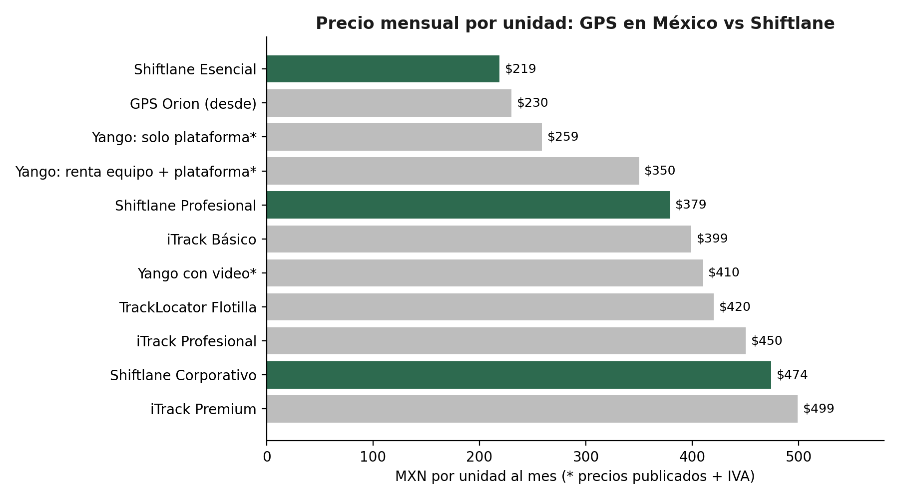

# Shiftlane — Sistema de precios

Investigación de precios de GPS, planes 5% más baratos y especificación del módulo de cobro

------------------------------------------------------------------------

*Precio por unidad al mes · garantía de igualación · reglas de cobro automáticas*

Felix Armando Acosta · Ciudad Juárez, Chihuahua · Octubre 2026

## 1. Resumen

Se investigó cuánto pagan hoy las empresas de transporte por el software de rastreo GPS de cada unidad, para fijar el precio de Shiftlane **5% por debajo** de lo que ya pagan. Con esa base se definió el sistema de precios y la especificación del módulo de cobro para desarrollarlo dentro de la plataforma.

| **Concepto** | **Resultado** |
|:--:|----|
| **Rango de precios de GPS para flotillas en México** | \$230 a \$499 MXN por unidad al mes en planes estándar; servicios avanzados hasta \$1,000+ |
| **Precio típico de un plan completo de flotilla** | ≈ \$399–\$420 MXN por unidad al mes |
| **Mediana de los planes encontrados** | ≈ \$404 MXN por unidad al mes |
| **Precio principal de Shiftlane** | **\$379 MXN por unidad al mes** (5% menos que \$399) |
| **Regla general** | Garantía de igualación: si el cliente demuestra que paga menos, Shiftlane cobra 5% menos que eso (con un piso de \$199) |

> **Punto clave:** el 5% solo es ahorro real si Shiftlane **sustituye** el servicio de rastreo que el cliente paga hoy. Si el cliente conserva su GPS actual y además contrata Shiftlane, pagará casi el doble. Por eso el sistema de precios ofrece modalidades donde Shiftlane reemplaza el rastreo (con el celular o conectándose al equipo GPS que ya tienen).

## 2. Cuánto pagan hoy por GPS

*Figura 1. Precios publicados por unidad y precios propuestos de Shiftlane*

| **Proveedor** | **Plan** | **Precio por unidad al mes** | **Incluye / condiciones** |
|:--:|----|----|----|
| **GPS Orion** | Plataforma | Desde \$230 (+\$10 multi-operador) | Plan de entrada |
| **Yango GPS** | Solo plataforma (equipo comprado aparte) | \$258.62 + IVA | Equipo GPS e instalación: \$2,640 + IVA único |
| **Yango GPS** | Renta 24 meses | \$350 + IVA | Equipo + plataforma |
| **Yango GPS** | Con video | \$410 + IVA | Plataforma + transmisión 4G + 3 GB de video |
| **iTrack** | Básico | \$399 | Instalación gratuita, sin permanencia mínima |
| **iTrack** | Profesional | \$450 | Incluye control de combustible |
| **iTrack** | Premium | \$499 | APIs, desarrollo a la medida, SLA 99.9%, ideal para 200+ vehículos |
| **iTrack** | Instalación express | \$600 por vehículo (único) | Servicio adicional |
| **TrackLocator** | Flotilla (2 a 10 vehículos) | \$420 | Equipo en comodato o venta; instalación aparte |
| **Zeek GPS (referencia anterior)** | Servicios avanzados | Hasta \$1,000+ | Más instalación |

### 2.1 Cómo cobran

- **Por unidad al mes**, siempre. Es el modelo que el mercado ya entiende.

- **Equipo:** se compra (≈ \$2,640 + IVA en un ejemplo), se renta dentro de la mensualidad o se da en comodato.

- **Instalación:** cobro único (por ejemplo, \$600 por vehículo) o gratuita en algunos planes.

- **Descuentos por volumen** en flotillas grandes y contratos de plazo (renta a 24 meses).

- **Extras:** video, sensores, combustible, multi-operador, integraciones.

### 2.2 Software específico de transporte de personal

Existen aplicaciones dedicadas (por ejemplo, BussRide, que promueve el control digital de aforos de transporte de personal, o plataformas como Driven en Perú y GOFER sobre Wialon en otros países), pero **no publican precios**: se venden bajo cotización. Por eso el precio de referencia más confiable es el del GPS de flotillas, que es lo que una transportista típica paga hoy.

> Algunos precios se publican con IVA aparte y otros no lo indican. Para cotizar a un cliente real, la comparación siempre debe hacerse con el mismo criterio: precio antes de IVA contra precio antes de IVA.

## 3. Cómo se aplica la regla del 5%

| **Paso** | **Detalle** |
|:--:|----|
| **1. Precio de lista** | Cada plan de Shiftlane está 5% por debajo del plan equivalente más común del mercado |
| **2. Garantía de igualación** | Si el cliente muestra su factura actual de GPS y paga menos por unidad que el precio de lista, se le cobra 95% de lo que paga hoy |
| **3. Piso** | Nunca menos de \$199 por unidad (para cubrir costos de operación y soporte) |
| **4. Mismo criterio de impuestos** | Se compara siempre precio sin IVA contra precio sin IVA |
| **5. Vigencia** | El precio igualado se respeta durante 12 meses y luego se revisa |

### 3.1 Modalidades para que el ahorro sea real

| **Modalidad** | **Cómo funciona** | **Qué paga el cliente** |
|:--:|----|----|
| **A. Reemplazo con celular** | Shiftlane rastrea con el celular del chofer y sustituye la plataforma GPS que pagan hoy | Solo Shiftlane (5% menos) + celular y datos de cada unidad |
| **B. Conectado a su GPS** | El cliente conserva su equipo GPS y su línea de datos; cambia la plataforma por Shiftlane, que lee las posiciones de su equipo | Shiftlane (5% menos que la plataforma que pagaba) + la línea de datos del equipo |
| **C. Todo incluido con socio** | Un proveedor de GPS aliado pone equipo e instalación; Shiftlane pone el software; una sola mensualidad | Precio 5% menor a lo que paga hoy por equipo + plataforma |

**Advertencia sobre la modalidad A:** el celular no reemplaza funciones de seguridad del equipo GPS físico como el paro de motor o la detección de robo, y algunas aseguradoras exigen equipo GPS instalado. En esos casos conviene la modalidad B o C.

## 4. Planes y precios de Shiftlane

| **Plan** | **Precio por unidad al mes (+ IVA)** | **Referencia de mercado (−5%)** | **Incluye** |
|:--:|----|----|----|
| **Esencial** | \$219 | GPS básico desde \$230 | App del chofer con revisión de celular, abordaje con QR o gafete, mapa en vivo, historial de viajes, alertas básicas, modo sin señal |
| **Profesional (recomendado)** | \$379 | Plan completo de flotilla ≈ \$399 | Todo lo anterior + portal de la planta, diagnóstico de unidades, cumplimiento y vencimientos, conciliación y prefactura, solicitudes de la planta, cambios temporales de ruta, configuración remota y modo kiosco |
| **Corporativo** | \$474 | Plan premium ≈ \$499 | Todo lo anterior + conexión con GPS existentes, app del pasajero completa, API, analítica de ocupación, facturación electrónica integrada, soporte prioritario |

### 4.1 Reglas comerciales

| **Regla** | **Valor** |
|:--:|----|
| **Unidad facturable** | Unidad con al menos un viaje registrado en el mes (las unidades sin uso no se cobran) |
| **Mínimo mensual por cuenta** | \$2,000 + IVA |
| **Piloto** | 60 días gratis con instalación y configuración incluidas, con criterios de éxito y precio acordados por escrito antes de iniciar |
| **Implementación después del piloto** | \$0 (ventaja frente a instalaciones de \$600 por unidad) |
| **Pago anual** | Equivalente a 10 meses (2 meses gratis) |
| **Contrato de 24 meses** | 5% adicional de descuento |
| **Garantía de igualación** | 95% de lo que paga hoy por unidad, con piso de \$199 |
| **Portal de la planta** | Incluido sin costo para las plantas clientes de la transportista |
| **Plan «Planta» (opcional)** | Para maquilas que quieran ver a varias transportistas: \$1,500 al mes por planta |
| **Mensajes SMS** | Incluidos hasta un límite mensual por unidad; el excedente se cobra a costo |

### 4.2 Ejemplos de cotización

| **Flota** | **Paga hoy por unidad** | **Paga hoy al mes** | **Shiftlane Profesional (igualado −5%)** | **Shiftlane al mes** | **Ahorro mensual** |
|:--:|----|----|----|----|----|
| **20 unidades** | \$399 | \$7,980 | \$379 | \$7,580 | \$400 |
| **60 unidades** | \$420 | \$25,200 | \$379 | \$22,740 | \$2,460 |
| **150 unidades** | \$450 | \$67,500 | \$379 | \$56,850 | \$10,650 |

Si el cliente paga por encima del precio de lista, se le ofrece el precio de lista del plan equivalente (por ejemplo, \$379), con un ahorro mayor al 5%. Si paga menos, se aplica la garantía de igualación.

### 4.3 Lo que el cliente gana además del precio

- Sin costo de instalación por unidad (en la modalidad A).

- Abordaje, evidencia, portal para la planta y prefactura con conciliación, que un GPS normal no ofrece.

- Sin permanencia obligatoria en el plan mensual.

## 5. Ingresos esperados con estos precios

| **Escenario** | **Clientes** | **Unidades** | **Precio promedio** | **Ingreso mensual** |
|:--:|----|----|----|----|
| **Inicial (año 1)** | 3 transportistas | 120 | \$379 | \$45,480 |
| **Medio** | 5 transportistas | 250 | \$379 | \$94,750 |
| **Con igualaciones a la baja** | 5 transportistas | 250 | \$300 | \$75,000 |
| **Mínimo (todo en Esencial)** | 5 transportistas | 250 | \$219 | \$54,750 |

Cifras antes de IVA, comisiones de pago e impuestos. El ingreso depende más del número de unidades que del número de clientes: una sola transportista mediana equivale a decenas de clientes de otros nichos.

## 6. Especificación del módulo de cobro (para desarrollarlo)

Esta sección describe lo que debe construirse dentro de la plataforma para aplicar el sistema de precios de forma automática.

### 6.1 Datos que guarda el sistema

| **Elemento** | **Información** |
|:--:|----|
| **Plan** | Nombre, precio de lista por unidad, funciones incluidas, mínimo mensual |
| **Suscripción de la cuenta** | Plan, modalidad (A, B o C), fecha de inicio, periodo (mensual, anual, 24 meses), estado (piloto, activa, vencida, suspendida, cancelada), fecha fin del piloto |
| **Precio especial** | Precio igualado por unidad, evidencia (factura del proveedor anterior), quién lo autorizó, fecha de vigencia y fecha de revisión |
| **Descuentos** | Anual, contrato de 24 meses, promociones; con fechas |
| **Uso del periodo** | Unidades con viaje en el mes, conteo de viajes, mensajes enviados |
| **Factura** | Periodo, unidades facturadas, precio aplicado, subtotal, descuentos, IVA, total, estado, folio fiscal, archivos PDF/XML |
| **Pagos** | Fecha, monto, método (transferencia con referencia, tarjeta), factura a la que se aplica |
| **Datos fiscales del cliente** | RFC, razón social, régimen, código postal, uso de CFDI, correos de facturación |

### 6.2 Reglas que debe aplicar automáticamente

1.  Al cierre de cada mes, contar las unidades con al menos un viaje registrado.

2.  Determinar el precio por unidad: precio especial vigente si existe; si no, precio de lista del plan.

3.  Aplicar el piso de \$199 y luego los descuentos vigentes.

4.  Calcular subtotal = unidades × precio; si es menor al mínimo mensual, cobrar el mínimo.

5.  Calcular IVA y total; generar la factura electrónica.

6.  Para planes anuales o de 24 meses: cobrar por adelantado según unidades contratadas y ajustar al final del periodo si se usaron más unidades.

7.  Durante el piloto: registrar el uso, mostrar al cliente «lo que costaría» cada mes y no cobrar.

### 6.3 Flujos

| **Flujo** | **Pasos** |
|:--:|----|
| **Cotización desde el sitio web** | El prospecto indica cuántas unidades tiene y cuánto paga por unidad; la calculadora muestra el precio de Shiftlane (−5% o precio de lista) y el ahorro mensual; se crea el prospecto en la consola |
| **Alta de piloto** | Se crea la cuenta con estado «piloto», fecha de fin, criterios de éxito y precio acordado; recordatorios automáticos a 30, 15 y 5 días del fin |
| **Igualación de precio** | El cliente sube la factura de su proveedor actual; tú la revisas en la consola y apruebas el precio especial con vigencia de 12 meses |
| **Conversión a pago** | Al terminar el piloto, la cuenta pasa a «activa» con el precio acordado; se envía bienvenida con datos de pago |
| **Facturación mensual** | Cierre automático el último día del mes, factura el día 1, envío por correo y en el panel «Mi suscripción» |
| **Pago** | Transferencia con referencia única por cliente (conciliación automática) o tarjeta; recibo automático |
| **Cambio de plan o de unidades** | Se refleja automáticamente en la siguiente factura; los cambios de plan a mitad de mes se prorratean |
| **Revisión del precio especial** | Aviso automático 30 días antes de vencer la vigencia de 12 meses |

### 6.4 Pagos atrasados (sin afectar la operación)

| **Día después del vencimiento** | **Acción automática** |
|:--:|----|
| **Día 1** | Recordatorio por correo y WhatsApp al contacto de facturación |
| **Día 5** | Segundo recordatorio y aviso en el panel de la transportista |
| **Día 10** | Aviso al dueño de la cuenta y a ti en la consola |
| **Día 20** | Funciones administrativas restringidas (reportes, exportaciones, nuevos usuarios); la operación diaria (app del chofer, monitoreo, abordaje) sigue funcionando |
| **Día 45** | Suspensión programada, avisada con 5 días de anticipación y nunca durante un turno en curso |

Regla de oro: **la operación de los viajes nunca se corta de forma repentina**, para no dejar trabajadores sin transporte.

### 6.5 Pantallas

- **Sitio web:** calculadora de precio y ahorro; página de planes.

- **Panel de la transportista, «Mi suscripción»:** plan, precio aplicado, unidades del mes en curso, estimado de la próxima factura, facturas y pagos, datos fiscales, cambio de plan.

- **Consola de plataforma:** lista de suscripciones, pilotos por vencer, precios especiales por aprobar, facturas del mes, pagos pendientes, ingreso recurrente mensual, unidades totales, cancelaciones.

### 6.6 Notificaciones del módulo

- Al cliente: fin de piloto, factura emitida, pago recibido, pago vencido, cambio de plan, revisión de precio especial.

- A ti: nuevo prospecto, piloto por vencer, precio especial por aprobar, pago vencido a 10 días, cancelación.

### 6.7 Reportes del negocio

- Ingreso recurrente mensual, unidades facturadas, precio promedio por unidad, ingreso por cliente.

- Pilotos activos y tasa de conversión a pago.

- Cuentas con atraso y antigüedad de saldos.

- Cancelaciones y su motivo.

### 6.8 Integraciones

- Facturación electrónica mediante proveedor de timbrado.

- Pago con tarjeta mediante pasarela (por ejemplo, Stripe) y transferencias SPEI con referencia por cliente.

- Correo y WhatsApp para avisos de cobranza.

## 7. Advertencias

- Los precios de GPS son los publicados por cada proveedor; las transportistas grandes suelen negociar precios menores. La garantía de igualación cubre ese caso.

- El ahorro del 5% solo existe si Shiftlane sustituye el servicio de rastreo actual; si el cliente conserva ambos, el argumento de venta debe ser el valor adicional, no el precio.

- La modalidad A requiere que la transportista tenga celulares Android y datos en cada unidad; ese costo debe mencionarse en la propuesta.

- Verificar precios con 3 o 4 proveedores locales en Ciudad Juárez antes de publicar los planes.

## Anexo. Fuentes

| **Proveedor** | **Fuente** |
|:--:|----|
| **iTrack** | i-track.mx (planes \$399, \$450, \$499; instalación \$600) |
| **Yango GPS** | yangogps.com (equipo \$2,640 + IVA; plataforma \$258.62; renta \$350 + IVA; video \$410 + IVA) |
| **TrackLocator** | tracklocator.com.mx/precios (flotilla \$420 por unidad) |
| **GPS Orion, Zeek GPS** | Investigación previa (desde \$230; avanzados hasta \$1,000+) |
| **Software de transporte de personal** | BussRide (LinkedIn), Driven (Andina, Infomercado), GOFER/Wialon (caso publicado) |
